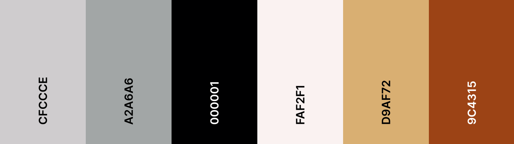
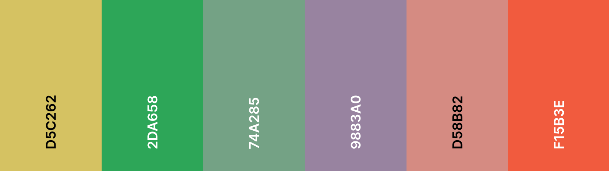
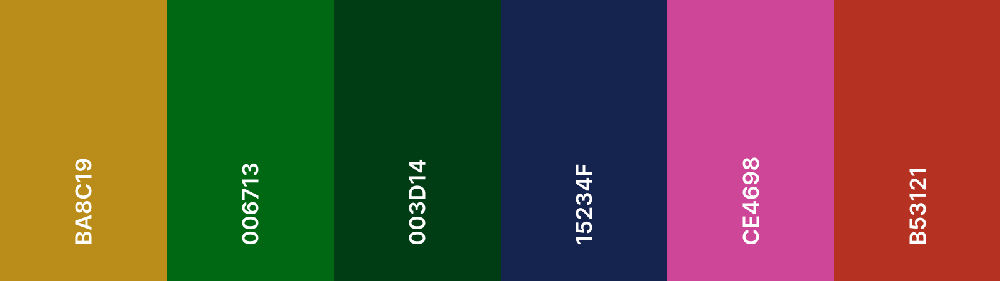
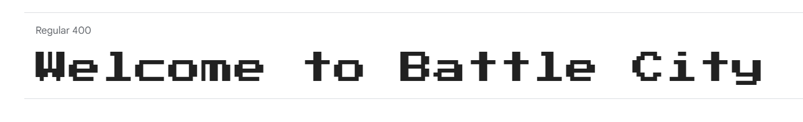

# Battle City

*Created by:* <strong>8-Bit Alchemists</strong>

View the deployed game [here](https://dima-bulavenko.github.io/BattleCity/).

---

## User Experience

### User Stories

As a player I want to:
- Read instructions on how to play the game
- See my tank interacting in the game environment
- Control my tanks movements using arrow keys
- Rotate my tank when changing directions
- Fire bullets so I can defeat my opponent
- See my score displayed on the screen so I can track my progress
- See my how many lives I have remaining
- Exit the gameplay (/to read instructions)
- Mute the sounds in case I am in a public space

As the game owner I want to:
- Create a game that is fun & nostalgic
- Provide a fully responsive game
- Create simple navigation
- Clear prompts using visuals & 8 bit sound effects
- Have a sound icon so users can mute & unmute sounds

---

## Features

| Features | Existing Features | Future Implementations | Screenshots |
| --- | --- | --- | --- |

### Gameplay

---

## Design

### Colour Scheme

The following colours were generated from the [Battle City Spritsheet](assets/battle_city_spritesheet.png) using [Coolors](https://coolors.co/). We chose a selection of neutral, muted and strong colours. They accent the gaming environment with an array of contrasts available.

### Typography

The [Press Start 2P](https://fonts.google.com/specimen/Press+Start+2P?preview.text=Welcome%20to%20Battle%20City&query=Press+Start+2P) font adds to the pixelated theme of the game. It adds some fun, and evokes a feeling of nostalgia. It is illustrative, yet has a structural integrity and readability to it. The user can get a clear sense of the design from this font.

### Imagery

### Favicon

### Flowchart

- 

---

## Testing

Please see [TESTING.md](TESTING.md) for a comprehensive list of tests performed.

---

## Technologies Used

### Languages

- [HTML](https://developer.mozilla.org/en-US/docs/Web/HTML) was used to create the page structure.
- [CSS](https://developer.mozilla.org/en-US/docs/Web/css) was used to create the layout and add styles.
- [JavaScript](https://developer.mozilla.org/en-US/docs/Web/JavaScript) was used to add interactivity to the game & page.

### Frameworks, Libraries & Programs

- [Google Chrome Developer Tools](https://developer.chrome.com/docs/devtools/overview/)
- [GitHub](https://github.com/) - To store associated files & developments of the website.
- [Gitpod](https://www.gitpod.io/) - IDE used.
- [Phaser](https://phaser.io/) - To create game.
- [Tiled](https://www.mapeditor.org/) - Map editor used.
- [VS Code](https://code.visualstudio.com/) - IDE used.

---

## Deployment

The live link can be found [here](https://dima-bulavenko.github.io/BattleCity/).

---

## Credits

### Media

* [Coolors](https://coolors.co/) to create colour palettes.
* [Favicon](https://favicon.io/) for favicon generation
* [Flaticon](https://favicon.io/) for favicon image
* [Freesound](https://freesound.org/) for sounds
* [Google Fonts](https://fonts.google.com/) to extract fonts for the website.

### Code
*REFERENCE ANY CODE COPIED FROM EXTERNAL SOURCES HERE*

### Collaborators

[Berat Zorlu]() 
[Dănuț Grigore](https://github.com/Danut89) 
[Dima Bulavenko](https://github.com/Dima-Bulavenko) 
[Hope Tracy Njoroge](https://github.com/Njorogetracy) 
[Kate McGuane](https://github.com/KateMcGuane) 
[Nonty Dazana](https://github.com/NontyD)

### Acknowledgemnets

We would like to thank Code Institute for hosting Pixel Pioneers.
