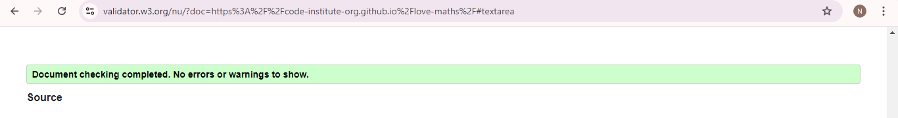
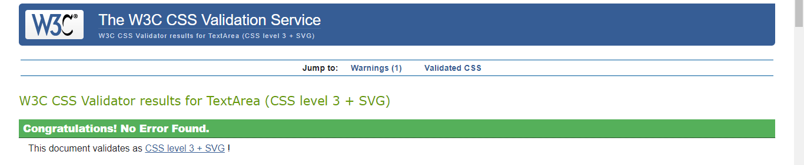

# *Battle City*

## Validator Testing

- HTML
    - [W3C validator](https://validator.w3.org/nu/?doc=https%3A%2F%2Fcode-institute-org.github.io%2Flove-maths%2F)
    
    
- CSS
    - [(Jigsaw) validator](https://jigsaw.w3.org/css-validator/validator?uri=https%3A%2F%2Fvalidator.w3.org%2Fnu%2F%3Fdoc%3Dhttps%253A%252F%252Fcode-institute-org.github.io%252Flove-maths%252F&profile=css3svg&usermedium=all&warning=1&vextwarning=&lang=en)
    
- JavaScript
    - [Jshint validator](https://jshint.com/)

---

## Manual Testing

| Features         | Expected Outcome                                      | Test Performed                | Results                                  | Outcome |
| ---------------- | ----------------------------------------------------- | ----------------------------- | ---------------------------------------- | ------- |
| Start game       | when clicked, it should take you to the game          | clicked button                | The game started                         | Pass    |
| Sound button     | Turns sound on / off when clicked                     | clicked when the sound was on | sound muted                              | Pass    |
| Instructions     | When clicked the games instructions pop up in a modal | clicked                       | The modal popped up with instructions    | Pass    |
| Close button     | When clicked the modal should be closed               | clicked                       | Modal closed                             | Pass    |
| High scores      | When clicked the games instructions pop up in a modal | clicked                       | The modal popped up with instructions    | Pass    |
| Playing the game |                                                       |                               |                                          |         |
| left arrow       | When pressed the tank moves to the left               | left arrow was pressed        | The tank moved to the left               | Pass    |
| right arrow      | When pressed the tank moves to the right              | right arrow was pressed       | The tank moved to the right              | Pass    |
| up arrow         | When pressed the tank moves up                        | up arrow was pressed          | The tank moved to the upward direction   | Pass    |
| down arrow       | When pressed the tank moves down                      | down arrow was pressed        | The tank moved to the downward direction | Pass    |
| space bar        | When pressed the tank shoots                          | space bar was pressed         | The tank shot                            | Pass    |

### Browser Compatibility

### User Stories Testing

### Features Testing

---

## Lighthouse Report

---

## Bugs

### Solved Bugs

### Known Bugs

